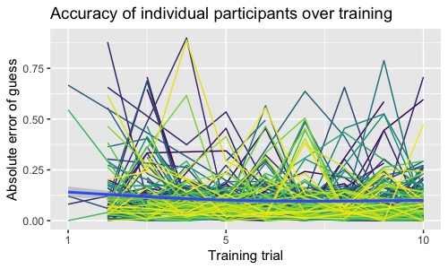

This R markdown provides the basis for our manuscript, "Interpersonal coordination in perception and memory" (Paxton, Morgan, Suchow, & Griffiths, *in preparation*).

To run these analyses from scratch, you will need the following files:

* `./data/`: Contains experimental data. All data for included dyads are freely available in the OSF repository for the project: `https://osf.io/8fu7x/`.
* `./supplementary-code/required_packages-pmc.r`: Installs required libraries, if they are not already installed. **NOTE**: This should be run *before* running this script.
* `./supplementary-code/libraries_and_functions-pmc.r`: Loads in necessary libraries and creates new functions for our analyses.

Additional files will be created during the initial run that will help reduce processing time. Several of these files are available as CSVs from the OSF repository listed above.

**Code written by**: A. Paxton (University of California, Berkeley)

**Date last modified**: 26 January 2018

***

# Data preparation

***

## Preliminaries


```r
# clear our workspace
rm(list=ls())

# read in libraries and create functions
source('./supplementary-code/required_packages-pmc.r')
source('./supplementary-code/libraries_and_functions-pmc.r')
```

***

## Concatenate experiment files


```r
# get list of individual experiments included in the data
experiment_files = list.dirs('./data', recursive=FALSE)

# concatenate the files
vector_files = data.frame()
info_files = data.frame()
questionnaire_files = data.frame()
node_files = data.frame()
for (experiment in experiment_files){
  
  # read in the next experiment's files and add ID to each
  exp_id = strsplit(as.character(experiment),"/|-")[[1]][3]
  next_vector = read.table(paste(experiment,'/vector.csv',sep=''), sep=',',
                           header=TRUE, stringsAsFactors = FALSE) %>%
    mutate(experiment = exp_id)
  next_info = read.table(paste(experiment,'/info.csv',sep=''), sep=',',
                         header=TRUE, stringsAsFactors = FALSE) %>%
    mutate(experiment = exp_id)
  next_q = read.table(paste(experiment,'/question.csv',sep=''), sep=',',
                           header=TRUE, stringsAsFactors = FALSE) %>%
    mutate(experiment = exp_id)
  next_node = read.table(paste(experiment,'/node.csv',sep=''), sep=',',
                           header=TRUE, stringsAsFactors = FALSE) %>%
    mutate(experiment = exp_id)

  # append to group files
  vector_files = rbind.data.frame(vector_files, next_vector)
  info_files = rbind.data.frame(info_files, next_info)
  questionnaire_files = rbind.data.frame(questionnaire_files, next_q)
  node_files = rbind.data.frame(node_files, next_node)

}
```

## Identify dyads from vector data

In order to figure out which participants' nodes were connected to one another in dyads, we use the vectors created between nodes (excluding the stimulus-creating node). We then use that information to identify which stimuli were sent to which dyads.


```r
# use the vectors connecting the nodes to identify pairs
vector_df = vector_files %>%
  
  # convert time to integer and winnow out unnecessary variables and nodes
  mutate(t = round(as.numeric(ymd_hms(creation_time)), 0)) %>%
  select(experiment, t, origin_id, destination_id, network_id) %>%
  dplyr::filter(!origin_id == 1) %>%
  
  # find pairs from vector files
  group_by(experiment, t) %>%
  mutate(min_id = pmin(origin_id,destination_id)) %>%
  mutate(max_id = pmax(origin_id,destination_id)) %>%
  ungroup() %>%
  
  # get unique pairs and number them
  select(-origin_id, -destination_id) %>%
  distinct() %>%
  mutate(dyad = seq_along(min_id)) %>%

  # gather the participants into a single column
  gather(key="id",value="participant", min_id, max_id) %>%
  select(-id)

# figure out which stimuli were sent to which dyads
dyad_df = info_files %>%
  mutate(t = round(as.numeric(ymd_hms(creation_time)), 0)) %>%
  dplyr::filter(origin_id == 1) %>%
  select(experiment, t, contents) %>%
  full_join(., vector_df,
            by = c('experiment', 't')) %>%
  select(-t)
```

## Prepare dataframe

We now take the concatenated files and begin processing, including de-duplication of dataset.

The structure of the experiment sometimes led to near-duplicate rows to be sent to the server to manage partner communication. We must now identify these near-duplicates and strip them out. We can best identify these by using the `response_counter` variable: A properly de-duplicated dataset should have only 1 row per `response_counter` value in each trial for each participant.


```r
info_df = info_files %>% ungroup() %>%
  
  # filter out stimulus nodes
  dplyr::filter(!origin_id == 1) %>%
  
  # convert time and get rid of unnecessary variables
  mutate(t = round(as.numeric(ymd_hms(creation_time)), 0)) %>%
  select(experiment, t, property3, origin_id, network_id, contents) %>%
    
  # read in `contents` as JSONs
  cbind(., jsonlite::stream_in(textConnection(.$contents))) %>%

  # rename a whole slew of variables
  dplyr::rename(participant = origin_id,
                trial_type = trialType,
                trial_number = trialNumber,
                guess_counter = guessCounter,
                response_counter = responseCounter,
                accept_type = acceptType,
                response_type = responseType,
                length = chosenStimulusLength,
                stimulus_number = chosenStimulusNumber) %>%
  
  # get rid of unnecessary variables and arrange rows
  select(-property3, -finalAccuracy, -contents) %>%
  dplyr::arrange(experiment, participant, trial_number, response_counter) %>%
  
  # remove the automatically generated infos that produced NAs in `guess`
  dplyr::filter(!is.na(guess)) %>%
  
  # determine uniqueness without considering time or response_type
  group_by(experiment, participant, network_id, trial_type,
           trial_number, guess_counter, response_counter) %>%
  summarise_all(first) %>%
  ungroup() %>%
  
  # replace NAs from guesses and calculate error with each guess
  mutate(guess = replace(guess, guess<0, NA)) %>%
  mutate(guess_error = length - guess) %>%
  
  # merge info dataframe with dyad number information
  full_join(., dyad_df,
            by = c('experiment', 'participant','network_id')) %>%
  dplyr::rename(stimulus_list = contents)
```

```
## 
 Found 500 records...
 Found 1000 records...
 Found 1004 records...
 Imported 1004 records. Simplifying...
```


```
## Problematic rows identified (i.e., duplicates with differing accept types): 0
```

## Identify and winnow down data to usable dyads

Next, we identify all dyads in which both participants responded the same number of times. This ensures that we include only dyads who experienced the full and correct experimental protocol.


```r
# identify usable dyads
paired_individuals = info_df %>%
  
  # count the number of infos and trials per participant
  group_by(experiment,participant) %>%
  summarise(trials = max(trial_number),
            dyad = ifelse(length(unique(dyad)==1),
                          unique(dyad),
                          NA),
            infos = n()) %>%
  ungroup() %>%
  na.omit() %>%
  
  # count the infos sent by each participant in each dyad
  group_by(experiment, dyad) %>%
  mutate(participant = paste('p',(participant - min(participant)),sep='')) %>%
  spread(key = participant, value = infos) %>%
  ungroup() %>%
  mutate(difference_in_responses = abs(p1-p0)) %>%
  
  # remove any participants who weren't paired with soemeone
  na.omit()
```


```
## Total participants with partners who finished: 6
```


```r
# only include pairs in which both individuals completed 24 trials
usable_dyads = dplyr::filter(paired_individuals, trials==24)

# exclude trials with mismatched data
discarded_trials_df = info_df %>%
  dplyr::filter(dyad %in% usable_dyads$dyad & trial_type=="test") %>%  
  
  # count the number of infos per trial per participant
  group_by(experiment,participant,trial_number) %>%
  summarise(dyad = ifelse(length(unique(dyad)==1),
                          unique(dyad),
                          NA),
            infos = n()) %>%
  ungroup() %>%
  na.omit() %>%
  
  # count the infos sent by each participant in each dyad
  group_by(experiment, dyad) %>%
  mutate(participant = paste('p',(participant - min(participant)),sep='')) %>%
  spread(key = participant, value = infos) %>%
  ungroup() %>%
  mutate(difference_in_responses = abs(p1-p0)) %>%
  
  # single out the trials with mismatching responses
  dplyr::filter(!difference_in_responses==0)
```


```
## Total trials discarded: 5 (across 3 dyads)
```


```r
# winnow and recorder columns
winnowed_info_df = info_df %>% ungroup() %>%
  dplyr::filter(dyad %in% usable_dyads$dyad) %>%
  dplyr::left_join(., discarded_trials_df,
                   by = c("experiment","dyad","trial_number")) %>%
  dplyr::filter(is.na(difference_in_responses)) %>%
  mutate(t = round(t,-1)) %>%
  select(experiment, t, dyad, participant, 
         trial_type, trial_number, response_counter, guess_counter, accept_type, 
         length, guess, guess_error, response_type, network_id) %>%
  na.omit()

winnowed_info_df = unique(setDT(winnowed_info_df), by = c('experiment', 'dyad',
        'participant', 'trial_type', 'trial_number', 'response_counter', 'guess_counter',
        'accept_type', 'length', 'guess', 'guess_error', 'response_type', 'network_id'))
```


```
## Mean included trials per dyad: 14.16667
```

For sanity, let's also check that everyone included in our winnowed dataset completed both training and test trials.


```r
# ensure that everyone completed both training and test
only_one_trial_type = winnowed_info_df %>% ungroup() %>%
  select(experiment, participant, trial_type) %>%
  distinct() %>%
  group_by(experiment, participant) %>%
  summarize(n=n()) %>%
  dplyr::filter(n!=2)
```


```
## Included participants who did not undergo training and testing rounds: 0
```

## Add questionnaire data

In the experiment's current form, different tables include different information, and some tables present the same information under different labels. This is true for questionnaire data. To accurately pair individuals' guess data with their questionnaire responses, we match the `participant_id` variables in `node_df` and `question_df`, and we join the `id` variable in `node_df` with the `participant` variable in `info_df`.


```r
# clean up questionnaire data by converting the stringified JSONs to a new variable
question_df = questionnaire_files %>% ungroup() %>%
  select(experiment, participant_id, response) %>%
  cbind(., jsonlite::stream_in(textConnection(.$response))) %>%
  select(-response)
```

```
## 
 Found 12 records...
 Imported 12 records. Simplifying...
```

```r
# clean up the node dataframe
node_df = node_files %>% ungroup() %>%
  select(experiment, participant_id, id) %>%
  na.omit()

# join questionnaire data wth infos and remove any participants whose survey data we don't have
winnowed_info_df = left_join(question_df, node_df,
                                by=c('experiment','participant_id')) %>%
  left_join(winnowed_info_df, .,
                              by=c('experiment','participant' = 'id')) %>%
  drop_na(cooperative_partner, cooperative_self, trust_partner, trust_self, engagement, difficulty)
```


```r
# identify how many dyads have matching infos and complete questionnaire data
usable_question_dyads = winnowed_info_df %>% ungroup() %>%
  select(experiment, dyad, participant) %>%
  distinct() %>%
  group_by(experiment, dyad) %>%
  summarise(included_p = n()) %>%
  ungroup() %>%
  dplyr::filter(included_p==2)

# if needed, remove dyads who didn't have questionnaire data
winnowed_info_df = winnowed_info_df %>% ungroup() %>%
  dplyr::filter(dyad %in% usable_question_dyads$dyad)
```


```
## Total dyads with all guess and questionnaire data: 6
```

## Create unique dyad and participant IDs across all experiments

Dallinger provides numeric IDs for each participant that are unique only within each experiment. Therefore, we create participant and dyad identifiers that are unique across the entire dataset.


```r
# create unique dyad IDs
unique_dyad_ids = winnowed_info_df %>% ungroup() %>%
  select(experiment, dyad) %>%
  distinct() %>%
  mutate(unique_dyad = row_number())

# create unique participant IDs
unique_participant_ids = winnowed_info_df %>% ungroup() %>%
  select(experiment, participant) %>%
  distinct() %>%
  mutate(unique_participant = row_number())

# merge both into the main dataframe and rename
winnowed_info_df = right_join(unique_participant_ids, winnowed_info_df,
                             by=c('experiment', 'participant')) %>%
  right_join(unique_dyad_ids, ., by=c('experiment','dyad')) %>%
  dplyr::rename(original_participant = participant,
                original_dyad = dyad,
                participant = unique_participant,
                dyad = unique_dyad) %>%
  dplyr::arrange(experiment, participant, trial_number, response_counter)
```

## Increment all counters by 1

Data were collected using Pythonic counters (i.e., starting from 0). We'll here update the dataframe to reflect R conventions (i.e., starting from 1).


```r
winnowed_info_df = winnowed_info_df %>%
  mutate(trial_number = trial_number + 1) %>%
  mutate(response_counter = response_counter + 1) %>%
  mutate(guess_counter = guess_counter + 1)
```

## Normalize error by maximum possible error

Because stimuli line lengths could range from 1-100, each trial provided a bound on the total possible guess error.  As a result, we need to normalize each guess error by the maximum *possible* error for that trial.


```r
winnowed_info_df = winnowed_info_df %>% ungroup() %>%
  mutate(normalized_error = guess_error/max(abs(100-length),abs(length-100)))
```

## Create training accuracy metric

We next create a training metric that quantifies the *non-directional* improvement over the training rounds. Essentially, this captures the change in relative accuracy over training, regardless of whether participants began by over- or under-estimating line lengths.


```r
# create a slope to see how quickly they improved
winnowed_info_df = winnowed_info_df %>% ungroup() %>%
  select(participant, trial_type, trial_number, normalized_error) %>%
  na.omit() %>%
  dplyr::filter(trial_type == 'train') %>%
  group_by(participant) %>%
  do(broom::tidy(lm(abs(.$normalized_error) ~ .$trial_number))) %>%
  dplyr::filter(term=='.$trial_number') %>%
  select(participant, estimate) %>%
  dplyr::rename(training_improvement = estimate) %>%
  left_join(winnowed_info_df, .,
            by='participant')
```





## Widen data to include partner's guess


```r
# create a column for the partner's guess at that time
winnowed_info_df = winnowed_info_df %>% ungroup() %>%
  
  # create participant binary values
  group_by(experiment, dyad) %>%
  mutate(partner_id = (min(participant)+max(participant)) - participant) %>%
  mutate(self_id = participant) %>%
  ungroup() %>%

  # gather into multiple values
  select(self_id, partner_id, normalized_error, trial_number, response_counter) %>%
  dplyr::rename(partner_error = normalized_error) %>%
  distinct() %>%
  
  # merge
  left_join(winnowed_info_df, .,
            by=c('participant'='self_id',
                 'trial_number',
                 'response_counter'))
```


## Export data


```r
write.table(winnowed_info_df, './data/winnowed_data.csv', sep=',',
            append = FALSE, quote = FALSE, na = "NA", row.names = FALSE, col.names = TRUE)
```

***

# Data exploration and descriptive statistics

## Preliminaries


```r
# clear our workspace
rm(list=ls())

# read in libraries and create functions
source('./supplementary-code/libraries_and_functions-pmc.r')

# read in dataset
winnowed_info_df = read.table('./data/winnowed_data.csv', sep=',',header = TRUE)
```

## Descriptive statistics


```r
# get list of individual experiments included in the data
experiment_files = list.dirs('./data', recursive=FALSE)

# concatenate the files
participant_files = data.frame()
for (experiment in experiment_files){
  
  # read in the next experiment's files and add ID to each
  exp_id = strsplit(as.character(experiment),"/|-")[[1]][3]
  next_participant = read.table(paste(experiment,'/participant.csv',sep=''), sep=',',
                           header=TRUE, stringsAsFactors = FALSE) %>%
    mutate(experiment = exp_id)

  # append to group files
  participant_files = rbind.data.frame(participant_files, next_participant)
}

# keep only the info we'll need
participant_time_df = participant_files %>%
  select(id, creation_time, end_time, experiment, worker_id, bonus) %>%
  mutate(creation_time = ymd_hms(creation_time)) %>%
  mutate(end_time = ymd_hms(end_time)) %>%
  mutate(duration = (end_time - creation_time))
```


```r
# identify how long all participants took to complete the experiment
all_participant_time = participant_time_df %>%
  select(-bonus) %>%
  na.omit()
```


```
## Average participation: 12.89602 minutes
```


```r
# identify how long included participants took to complete the experiment
included_participant_time = participant_time_df %>%
  na.omit()
```


```
## Average participation: 11.96328 minutes
```

We'd intended for each experimental session to last 20 minutes, but the mean duration for included participants in these pilot data is about half of that.  Future pilot studies should increase the number of trials.

## Variable distributions


