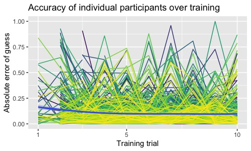
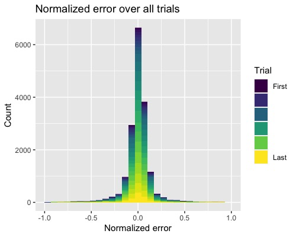
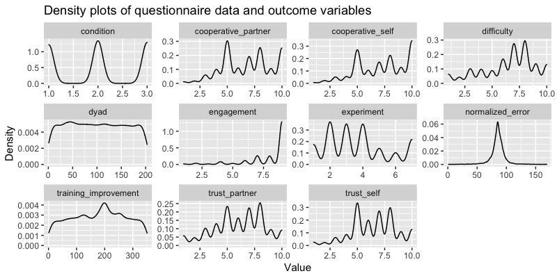
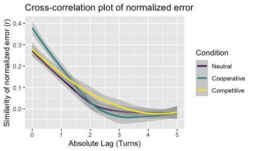

This R markdown provides the data preparation for our manuscript, "Interpersonal
coordination in perception and memory" (Paxton, Morgan, Suchow, & Griffiths, *in
preparation*). This R markdown file presents the data preparation for Study 2,
which includes the neutral condition (same as Study 1) and adds a new
competitive condition and a new cooperative condition.

To run this from scratch, you will need the following files:

* `./data/study_2-neut_comp_coop/`: Contains experimental data. All data for 
  included dyads are freely available in the OSF repository for the project: 
  `https://osf.io/8fu7x/`.
* `./supplementary-code/libraries_and_functions-pmc.r`: Loads in necessary 
  libraries (including installation, if necessary) and creates new functions 
  for our analyses.

Additional files will be created during the initial run that will help reduce
processing time. Several of these files are available as CSVs from the OSF
repository listed above.

As part of our manuscript for the eventual paper, this R markdown file will be
converted into an .R script and embedded into the manuscript. Each time the
manuscript is compiled, a new .R version of this file will be generated, dated
to the last time this file was changed.

**Code written by**: A. Paxton (University of Connecticut)

**Date last modified**: 25 January 2021

***

# Data import

***

## Preliminaries


```r
# clear our workspace
rm(list=ls())

# read in libraries and create functions
source('./supplementary-code/libraries_and_functions-pmc.r')
```

***

## Concatenate experiment files


```r
# get list of individual experiments included in the data
experiment_files = list.dirs('./data/study_2-neut_comp_coop', recursive=FALSE)

# concatenate the files
vector_files = data.frame()
info_files = data.frame()
questionnaire_files = data.frame()
node_files = data.frame()
participant_files = data.frame()
for (experiment in experiment_files){
  
  # read in the next experiment's files and add ID to each
  exp_id = basename(experiment)
  next_vector = read.table(paste(experiment,'/vector.csv',sep=''), sep=',',
                           header=TRUE, stringsAsFactors = FALSE) %>%
    mutate(experiment = exp_id)
  next_info = read.table(paste(experiment,'/info.csv',sep=''), sep=',',
                         header=TRUE, stringsAsFactors = FALSE) %>%
    mutate(experiment = exp_id)
  next_q = read.table(paste(experiment,'/question.csv',sep=''), sep=',',
                           header=TRUE, stringsAsFactors = FALSE) %>%
    mutate(experiment = exp_id)
  next_node = read.table(paste(experiment,'/node.csv',sep=''), sep=',',
                           header=TRUE, stringsAsFactors = FALSE) %>%
    mutate(experiment = exp_id)
  next_participant = read.table(paste(experiment,'/participant.csv',sep=''), sep=',',
                           header=TRUE, stringsAsFactors = FALSE) %>%
    mutate(experiment = exp_id)

  # append to group files
  vector_files = rbind.data.frame(vector_files, next_vector)
  info_files = rbind.data.frame(info_files, next_info)
  questionnaire_files = rbind.data.frame(questionnaire_files, next_q)
  node_files = rbind.data.frame(node_files, next_node)
  participant_files = rbind.data.frame(participant_files, next_participant)

}
```

## Grab duration and bonus data


```r
# clean up the questionnaire files
question_trimmed = questionnaire_files %>%
  select(experiment, participant_id, number, question, response)

# clean up the participant files
participant_trimmed = participant_files %>%
  dplyr::filter(status=='submitted' | status=='approved') %>%
  mutate(creation_time = lubridate::ymd_hms(creation_time)) %>%
  mutate(end_time = lubridate::ymd_hms(end_time)) %>%
  mutate(duration = (end_time - creation_time)) %>%
  select(experiment, worker_id, status, base_pay, bonus, duration)

# join the files and omit any folks that aren't completely included in both dataframes
participation_descriptives = full_join(question_trimmed, participant_trimmed,
                                     by = c('experiment',
                                            'participant_id' = 'worker_id')) %>%
  
  # remove actual question data
  select(-response, -question, -status, -number)
```

## Identify dyads from vector data

In order to figure out which participants' nodes were connected to one another in dyads, we use 
the vectors created between nodes (excluding the stimulus-creating node). We then use that 
information to identify which stimuli were sent to which dyads.


```r
# use the vectors connecting the nodes to identify pairs
vector_df = vector_files %>%
  
  # convert time to integer and winnow out unnecessary variables and nodes
  mutate(t = round(as.numeric(lubridate::ymd_hms(creation_time)), 0)) %>%
  select(experiment, t, origin_id, destination_id, network_id) %>%
  dplyr::filter(!origin_id == 1) %>%
  
  # find pairs from vector files
  group_by(experiment, t) %>%
  mutate(min_id = pmin(origin_id,destination_id)) %>%
  mutate(max_id = pmax(origin_id,destination_id)) %>%
  ungroup() %>%
  
  # get unique pairs and number them
  select(-origin_id, -destination_id) %>%
  distinct() %>%
  mutate(dyad = seq_along(min_id)) %>%

  # gather the participants into a single column
  gather(key="id",value="participant", min_id, max_id) %>%
  select(-id)

# figure out which stimuli were sent to which dyads
dyad_df = info_files %>%
  mutate(t = round(as.numeric(lubridate::ymd_hms(creation_time)), 0)) %>%
  dplyr::filter(origin_id == 1) %>%
  select(experiment, t, contents) 

# combine the contents and the dyad info, allowing room for error with timestamp
dyad_df = data.table(dyad_df)
vector_df = data.table(vector_df)
setkey(dyad_df, experiment, t)
setkey(vector_df, experiment, t)
dyad_df = dyad_df[vector_df,roll="nearest"] %>%
  select(-t)
```

## Prepare dataframe

We now take the concatenated files and begin processing, including de-duplication of dataset.

The structure of the experiment sometimes led to near-duplicate rows to be sent to the server 
to manage partner communication. We must now identify these near-duplicates and strip them 
out. We can best identify these by using the `response_counter` variable: A properly 
de-duplicated dataset should have only 1 row per `response_counter` value in each trial for 
each participant.


```r
info_df = info_files %>% ungroup() %>%
  
  # filter out stimulus nodes
  dplyr::filter(!origin_id == 1) %>%
  
  # convert time and get rid of unnecessary variables
  mutate(t = round(as.numeric(lubridate::ymd_hms(creation_time)), 0)) %>%
  select(experiment, t, property3, origin_id, network_id, contents) %>%
    
  # read in `contents` as JSONs
  cbind(., jsonlite::stream_in(textConnection(.$contents))) %>%

  # rename a whole slew of variables
  dplyr::rename(participant = origin_id,
                condition = experimentCondition,
                trial_type = trialType,
                trial_number = trialNumber,
                guess_counter = guessCounter,
                response_counter = responseCounter,
                accept_type = acceptType,
                stimulus_number = chosenStimulusNumber,
                length = chosenStimulusLength,
                dyad_best = dyadBest,
                winning_participant = winningParticipant) %>%
  
  # get rid of unnecessary variables and arrange rows
  select(-property3, -finalAccuracy, -contents) %>%
  dplyr::arrange(experiment, participant, trial_number, response_counter) %>%
  
  # remove the automatically generated infos that produced NAs in `guess`
  dplyr::filter(!is.na(guess)) %>%
  
  # determine uniqueness without considering time
  group_by(experiment, participant, network_id, trial_type,
           trial_number, guess_counter, response_counter) %>%
  summarise_all(first) %>%
  ungroup() %>%
  
  # replace NAs from guesses and calculate error with each guess
  mutate(guess = replace(guess, guess<0, NA)) %>%
  mutate(guess_error = length - guess) %>%
  
  # merge info dataframe with dyad number information
  full_join(., dyad_df,
            by = c('experiment', 'participant','network_id')) %>%
  dplyr::rename(stimulus_list = contents)
```

```
## 
 Found 500 records...
 Found 1000 records...
 Found 1500 records...
 Found 2000 records...
 Found 2500 records...
 Found 3000 records...
 Found 3500 records...
 Found 4000 records...
 Found 4500 records...
 Found 5000 records...
 Found 5500 records...
 Found 6000 records...
 Found 6500 records...
 Found 7000 records...
 Found 7500 records...
 Found 8000 records...
 Found 8500 records...
 Found 9000 records...
 Found 9500 records...
 Found 10000 records...
 Found 10500 records...
 Found 11000 records...
 Found 11500 records...
 Found 12000 records...
 Found 12500 records...
 Found 13000 records...
 Found 13500 records...
 Found 14000 records...
 Found 14500 records...
 Found 15000 records...
 Found 15500 records...
 Found 16000 records...
 Found 16500 records...
 Found 17000 records...
 Found 17500 records...
 Found 18000 records...
 Found 18500 records...
 Found 19000 records...
 Found 19500 records...
 Found 20000 records...
 Found 20500 records...
 Found 21000 records...
 Found 21500 records...
 Found 22000 records...
 Found 22500 records...
 Found 23000 records...
 Found 23500 records...
 Found 24000 records...
 Found 24500 records...
 Found 25000 records...
 Found 25500 records...
 Found 26000 records...
 Found 26500 records...
 Found 27000 records...
 Found 27500 records...
 Found 28000 records...
 Found 28500 records...
 Found 29000 records...
 Found 29500 records...
 Found 29981 records...
 Imported 29981 records. Simplifying...
```


```
## Problematic rows identified(i.e., duplicates with differing accept types): 0
```

***

# Data cleaning

***

## Identify pairs 

Next, we identify all dyads in which both participants completed all trials.


```r
# identify usable dyads
paired_individuals = info_df %>%
  
  # count the number of infos and trials per participant
  group_by(experiment,participant,condition) %>%
  summarise(.groups = "keep",
            trials = max(trial_number),
            dyad = ifelse(length(unique(dyad)==1),
                          unique(dyad),
                          NA),
            infos = n()) %>%
  ungroup() %>%
  na.omit() %>%
  dplyr::filter(infos > 23) %>%
  
  # count the infos sent by each participant in each dyad
  group_by(experiment, dyad) %>%
  mutate(participant = ifelse(participant == min(participant),
                              'p0',
                              'p1')) %>%
  spread(key = participant, value = infos) %>%
  ungroup() %>%
  mutate(difference_in_responses = abs(p1-p0)) %>%

  # remove any participants who weren't paired with someone
  na.omit() %>%
  
  # only include pairs in which both individuals completed 24 trials
  dplyr::filter(trials==24)
```


```
## Total pairs who finished: 210
```


------------------
  condition    n  
------------- ----
 competitive   67 

 cooperative   74 

   neutral     69 
------------------

## Remove problematic dyads

Next, we need to remove problematic dyads. We have to kinds of problematic
dyads: mismatched dyads and uncooperative participants. The former are because
of an error in the game's programming; the latter are due to participants who do
not fully engage with the game. We handle each in turn.

### Mismatching dyads

Some dyads became mismatched in their progress throughout the game. Essentially,
in some trials, one player would move on to the next trial, while their partner
would "hang" in the previous one. The program would automatically move someone
forward after this mismatched state persisted for a few seconds.

To deal with this issue, we strike the entire dyad.

**Note**: This is a different choice than our previous one (in Study 1), which
struck only each trial. However, no dyads experienced this issue in the previous
version. In this version, we are more conservative and remove the entire dyad.


```r
# exclude trials with mismatched data
discarded_trials_df = info_df %>%
  dplyr::filter(dyad %in% paired_individuals$dyad & trial_type=="test") %>%  
  
  # count the number of infos per trial per participant
  group_by(experiment,participant,trial_number) %>%
  summarise(.groups="keep",
            dyad = ifelse(length(unique(dyad)==1),
                          unique(dyad),
                          NA),
            infos = n()) %>%
  ungroup() %>%
  na.omit() %>%
  
  # count the infos sent by each participant in each dyad
  group_by(experiment, dyad) %>%
  mutate(participant = paste('p',((participant!=min(participant))*1),sep='')) %>%
  spread(key = participant, value = infos) %>%
  ungroup() %>%
  mutate(difference_in_responses = abs(p1-p0)) %>%
  
  # single out the trials with mismatching responses
  dplyr::filter(!difference_in_responses==0)
```


```
## Removing 3 dyad(s) due to mismatch error
## Problem trials identified: 6 trial(s) across 3 dyad(s)
```

### Uncooperative participants

To play the game, both participants should be submitting a guess at each trial.
However, they do not have to do so in order to progress: Instead, they could opt
to continually accept their null guess. Such data will eventually result in
problematic cross-correlation profiles and coefficients, so we remove them here.
To allow freedom for participants' occasional choices to not submit a guess, we
remove participants who did not submit their own guess for at least 3 trials.


```r
uncooperative_participants = info_df %>% ungroup() %>%
  
  # remove participants who had mismatch errors
  dplyr::filter(!(dyad %in% total_removed_trials$dyad &
                    experiment %in% total_removed_trials$experiment)) %>%
  
  # selectively remove unsubmitted guesses and restrict to test
  drop_na(guess) %>%
  dplyr::filter(trial_number > 10) %>%
  
  # count how many guesses were submitted at each trial
  group_by(experiment, dyad, participant, trial_number) %>%
  summarize(.groups = "keep", submitted_guesses = n()) %>%
  
  # figure out how many total trials included one guess
  ungroup() %>%
  group_by(experiment, dyad, participant) %>%
  summarize(.groups = "keep", guessed_trials = n()) %>%

  # identify folks who weren't cooperative
  dplyr::filter(guessed_trials <= 3)
```


```
## Removing 31 participants and 22 dyads from dataset
## Uncooperative participants: 1.516129 mean test trial responses submitted
```


## Winnow the data


```r
# winnow and recorder columns
winnowed_info_df = info_df %>% ungroup() %>%
  
  # only allow paired participants to pass
  dplyr::filter(dyad %in% paired_individuals$dyad & 
                  experiment %in% paired_individuals$experiment) %>%
  
  # remove mismatched dyads
  dplyr::filter(!(dyad %in% total_removed_trials$dyad &
                    experiment %in% total_removed_trials$experiment)) %>%
  
  # remove uncooperative participants' dyads
  dplyr::filter(!(dyad %in% uncooperative_participants$dyad &
                    experiment %in% uncooperative_participants$experiment)) %>%
  
  # clean up the remaining dataset
  mutate(t = round(t,-1)) %>%
  select(experiment, condition, t, dyad, participant, 
         trial_type, trial_number, response_counter, guess_counter, accept_type, 
         length, guess, guess_error, network_id) %>%
  na.omit()

# create data table
winnowed_info_df = unique(setDT(winnowed_info_df), 
                          by = c('experiment', 'condition', 'dyad', 'participant', 
                                 'trial_type', 'trial_number', 'response_counter', 
                                 'guess_counter', 'accept_type', 'length', 'guess', 
                                 'guess_error', 'network_id'))
```


```
## Mean included trials per dyad: 15
```

## Quick sanity check

For sanity, let's also check that everyone included in our winnowed dataset
completed both training and test trials.


```r
# ensure that everyone completed both training and test
only_one_trial_type = winnowed_info_df %>% ungroup() %>%
  select(experiment, participant, trial_type) %>%
  distinct() %>%
  group_by(experiment, participant) %>%
  summarize(.groups = "keep", n=n()) %>%
  dplyr::filter(n!=2)
```


```
## Included participants who did not submit guesses during any training trials: 7
```

It looked like some participants chose not to complete the training trials or
struggled with getting their guesses submitted in time.  We'll need to handle
this when we create training slopes.

***

# Data processing

***

## Add questionnaire data

In the experiment's current form, different tables include different
information, and some tables present the same information under different
labels. This is true for questionnaire data. To accurately pair individuals'
guess data with their questionnaire responses, we match the `participant_id`
variables in `node_df` and `question_df`, and we join the `id` variable in
`node_df` with the `participant` variable in `info_df`.


```r
# clean up questionnaire data by converting the stringified JSONs to a new variable
question_df = questionnaire_files %>% ungroup() %>%
  select(experiment, participant_id, response) %>%
  cbind(., jsonlite::stream_in(textConnection(.$response))) %>%
  select(-response) %>%
  drop_na() %>%
  distinct()
```

```
## 
 Found 500 records...
 Found 616 records...
 Imported 616 records. Simplifying...
```

```r
# identify any duplicated IDs (can happen with fingerprint issues on Dallinger side)
duplicates = question_df %>% ungroup() %>%
  group_by(experiment, participant_id) %>%
  summarize(.groups = "keep", duplicates = n()) %>%
  dplyr::filter(duplicates != 1)

# remove duplicates
question_df = question_df %>% ungroup() %>%
    dplyr::filter(!(participant_id %in% duplicates$participant_id &
                      experiment %in% duplicates$experiment))

# clean up the node dataframe
node_df = node_files %>% ungroup() %>%
  select(experiment, participant_id, id) %>%
  na.omit()

# join questionnaire with infos and remove any participants without survey data
winnowed_info_df = left_join(question_df, node_df,
                                by=c('experiment','participant_id')) %>%
  left_join(winnowed_info_df, .,
                              by=c('experiment','participant' = 'id')) %>%
  drop_na(cooperative_partner, cooperative_self, trust_partner, trust_self, 
          engagement, difficulty)
```


```r
# identify how many dyads have matching infos and complete questionnaire data
usable_question_dyads = winnowed_info_df %>% ungroup() %>%
  select(experiment, dyad, participant) %>%
  distinct() %>%
  group_by(experiment, dyad) %>%
  summarize(.groups = "keep", included_p = n()) %>%
  ungroup() %>%
  dplyr::filter(included_p==2)

# if needed, remove dyads who didn't have questionnaire data
winnowed_info_df = winnowed_info_df %>% ungroup() %>%
  dplyr::filter(dyad %in% usable_question_dyads$dyad)
```


```
## Total dyads dropped due to conflicting questionnaires: 0
## Total dyads with all guess and questionnaire data: 203
```

## Export duration and bonus data for participants


```r
# link participants to their bonus and duration data
participation_descriptives = node_files %>%
  select(experiment, id, participant_id, network_id) %>%
  full_join(., participation_descriptives,
            by = c('participant_id',
                   'experiment')) %>%
  full_join(., dyad_df,
             by = c('id' = 'participant',
                    'experiment',
                    'network_id')) %>%
  dplyr::filter(dyad %in% usable_question_dyads$dyad & 
                  experiment %in% usable_question_dyads$experiment) %>%
  select(-contents, -network_id) %>%
  unique()
```


```r
# export bonuses
write.table(participation_descriptives,
            './data/study_2-neut_comp_coop/participation_descriptives.csv', 
            sep=',', append = FALSE, quote = FALSE, 
            row.names = FALSE, col.names = TRUE)
```

## Create unique dyad and participant IDs across all experiments

Dallinger provides numeric IDs for each participant that are unique only within
each experiment. Therefore, we create participant and dyad identifiers that are
unique across the entire dataset.


```r
# create unique dyad IDs
unique_dyad_ids = winnowed_info_df %>% ungroup() %>%
  select(experiment, dyad) %>%
  distinct() %>%
  mutate(unique_dyad = row_number())

# create unique participant IDs
unique_participant_ids = winnowed_info_df %>% ungroup() %>%
  select(experiment, participant) %>%
  distinct() %>%
  mutate(unique_participant = row_number())

# merge both into the main dataframe and rename
winnowed_info_df = right_join(unique_participant_ids, winnowed_info_df,
                             by=c('experiment', 'participant')) %>%
  right_join(unique_dyad_ids, ., by=c('experiment','dyad')) %>%
  dplyr::rename(original_participant = participant,
                original_dyad = dyad,
                participant = unique_participant,
                dyad = unique_dyad) %>%
  dplyr::arrange(experiment, participant, trial_number, response_counter)
```


```
## Total pairs included in analysis: 203
```


------------------
  condition    n  
------------- ----
 competitive   65 

 cooperative   70 

   neutral     68 
------------------

## Increment all counters by 1

Data were collected using Pythonic counters (i.e., starting from 0). We'll here
update the dataframe to reflect R conventions (i.e., starting from 1).


```r
winnowed_info_df = winnowed_info_df %>%
  mutate(trial_number = trial_number + 1) %>%
  mutate(response_counter = response_counter + 1) %>%
  mutate(guess_counter = guess_counter + 1)
```

## Normalize error by maximum possible error

Because stimuli line lengths could range from 1-100, each trial provided a bound
on the total possible guess error.  As a result, we need to normalize each guess
error by the maximum *possible* error for that trial.


```r
winnowed_info_df = winnowed_info_df %>% ungroup() %>%
  mutate(normalized_error = guess_error/max(abs(100-length),abs(length-100)))
```

## Create training accuracy metric

We next create a training metric that quantifies the *non-directional*
improvement over the training rounds. Essentially, this captures the change in
relative accuracy over training, regardless of whether participants began by
over- or under-estimating line lengths.


```r
# create a slope to see how quickly they improved
winnowed_info_df = winnowed_info_df %>% ungroup() %>%
  
  # if they didn't do training, give them a flat training performance
  mutate(normalized_error = replace(normalized_error, 
                                    which(normalized_error<0L), 
                                    0)) %>%
  
  select(participant, trial_type, trial_number, normalized_error) %>%
  na.omit() %>%
  dplyr::filter(trial_type == 'train') %>%
  group_by(participant) %>%
  do(broom::tidy(lm(abs(.$normalized_error) ~ .$trial_number))) %>%
  dplyr::filter(term=='.$trial_number') %>%
  select(participant, estimate) %>%
  dplyr::rename(training_improvement = estimate) %>%
  left_join(winnowed_info_df, .,
            by='participant') %>%
  
  # if they didn't complete training, give them a 0
  mutate(training_improvement = tidyr::replace_na(training_improvement, 
                                                  0))
```







## Widen data to include partner's guess


```r
# create a column for the partner's guess at that time
winnowed_info_df = winnowed_info_df %>% ungroup() %>%
  
  # create participant binary values
  group_by(experiment, dyad) %>%
  mutate(self_id = (min(participant)+max(participant)) - participant) %>%
  mutate(partner_id = participant) %>%
  ungroup() %>%

  # gather into multiple values
  select(self_id, partner_id, normalized_error, trial_number, response_counter) %>%
  dplyr::rename(partner_error = normalized_error) %>%
  distinct() %>%
  
  # merge
  left_join(winnowed_info_df, .,
            by=c('participant'='self_id',
                 'trial_number',
                 'response_counter'))
```

## Export raw data


```r
write.table(winnowed_info_df, 
            './data/study_2-neut_comp_coop/winnowed_data.csv', 
            sep=',', append = FALSE, quote = FALSE, na = "NA", 
            row.names = FALSE, col.names = TRUE)
```

***

# Data exploration and descriptive statistics

***

## Preliminaries


```r
# clear our workspace
rm(list=ls())

# read in libraries and create functions
source('./supplementary-code/libraries_and_functions-pmc.r')

# read in dataset
winnowed_info_df = read.table('./data/study_2-neut_comp_coop/winnowed_data.csv',
                              sep=',',header = TRUE)
```

## Bonuses and duration


```r
participation_descriptives = read.table('./data/study_2-neut_comp_coop/participation_descriptives.csv', 
                                        sep=',', header = TRUE)
```


```
## Average participation duration: 11.54299 minutes
```


```
## Average particpant performance bonus (minus flat completion bonus):  $1.61
```

## Variable distributions




***

# Data manipulation

***

## Preliminaries


```r
# clear our workspace
rm(list=ls())

# read in libraries and create functions
source('./supplementary-code/libraries_and_functions-pmc.r')

# read in dataset
winnowed_info_df = read.table('./data/study_2-neut_comp_coop/winnowed_data.csv',
                              sep=',', header = TRUE)
```

## Convert `condition` to numeric variable


```r
# convert neutral to 0, cooperative to 1, competitive to 2
winnowed_info_df = winnowed_info_df %>% ungroup() %>%
  mutate(condition = as.character(condition)) %>%
  mutate(condition = ifelse(condition=='neutral',
                           0,
                           ifelse(condition=='cooperative',
                                  1,
                                  2))) %>%
  mutate(condition = as.numeric(condition))
```

## Calculate cross-correlation between partners' normalized error

First, we prepare the dataframe for cross-correlation by transitioning from
long-form data for both participants within the dyad to using wide-form data for
each dyad, with one column for each constituent participant's `normalized_error`
at each `trial_number` and `response_counter`.


```r
# strip out unnecessary information
infos = winnowed_info_df %>% ungroup() %>%
  select(experiment,
         dyad,
         participant,
         condition,
         t,
         normalized_error,
         trial_number,
         response_counter) %>%
  
  # create participant binary values
  group_by(experiment, dyad) %>%
  mutate(partner_id = (min(participant)+max(participant)) - participant) %>%
  mutate(self_id = participant) %>%
  ungroup() %>%
  
  # create binary ID
  group_by(experiment, dyad) %>%
  mutate(partner_binary = (participant != min(participant)) * 1) %>%
  ungroup() %>%
  
  # remove training trials
  dplyr::filter(trial_number > 10)

# create dataframe with one dyad per row, separate columns for participant error
binary_dfs = split(infos, infos$partner_binary)
p0_df = data.frame(binary_dfs[[1]]) %>%
  dplyr::rename(error0 = normalized_error) %>%
  select(experiment, dyad, condition, trial_number, response_counter, error0)
p1_df = data.frame(binary_dfs[[2]]) %>%
  dplyr::rename(error1 = normalized_error) %>%
  select(experiment, dyad, condition, trial_number, response_counter, error1)
```

Once the data are prepared, we calculate the cross-correlation coefficients between 
participants' `normalized_error` during all test rounds. The maximum lag is specified 
within the `libraries_and_functions-pmc.r` file.


```r
# calculate cross-correlation
ccf_df = full_join(p0_df,p1_df,
                   by = c("experiment", 
                          "dyad", 
                          "condition", 
                          "trial_number", 
                          "response_counter")) %>%
  
  # calculate cross-correlation for each dyad's error scores
  group_by(experiment,dyad) %>%
  do(ccf = ccf(.$error0, .$error1, 
               lag.max = ccf_max_lag, 
               type = 'correlation',
               na.action = na.pass, 
               plot=FALSE)) %>%
  ungroup() %>%
  
  # extract cross-correlations from the embedded list
  select(ccf) %>%
  dplyr::pull(ccf) %>%
  unlist() %>%
  matrix(.,
         ncol=length(unique(winnowed_info_df$dyad))) %>%
  
  # convert it into a proper dataframe and select only the coefficients
  as.data.frame() %>%
  slice(1:(ccf_max_lag*2+1)) %>%
  t() %>%
  as.data.frame %>%
  rowid_to_column(var='dyad') %>%

  # rename variables and strip rownames
  dplyr::rename_with(.cols=starts_with("V"),
                     .fn=function(x) {gsub("V", "", x)}) %>%
  remove_rownames() %>%
  
  # reshape the data to combine lag and r
  gather(key = 'lag' , value='r', -dyad) %>%
  mutate_all(as.numeric) %>%
  mutate(lag = lag - ccf_max_lag - 1)
```

Because we don't have any theoretical expectations about or experimental manipulations to 
change *who* might be leading and following, we ignore directionality for this first-pass analysis.


```r
# ignore lag directionality
ccf_df = ccf_df %>% ungroup() %>%
  mutate(lag = abs(lag)) %>%
  group_by(dyad,lag) %>%
  summarise(.groups="keep",
            r = mean(r))
```

Once we've calculated the cross-correlation coefficients for each dyad, we merge it into 
the questionnaire data.


```r
# grab what we need for the cross-correlation analyses
questions_only = winnowed_info_df %>%
  select(one_of(c('experiment','dyad','participant', 'condition',
                  questionnaire_variables, 'training_improvement'))) %>%
  
  # create a mean training improvement score for the dyad
  group_by(experiment, dyad) %>%
  mutate(training_improvement = mean(training_improvement)) %>%
  ungroup() %>%
  
  # select only the unique rows
  distinct() 

# merge into the ccf dataframe
ccf_df = full_join(questions_only, ccf_df,
                   by='dyad','experiment')
```

Let's clean up a bit before we move on.


```r
# clean up unneeded variables
rm(p0_df, p1_df, binary_dfs, infos, questions_only)
```

## Prepare for analyses building from Study 1

Because we are building from the analyses in Study 1, we here prepare the dataset simply to 
handle those planned analyses, with the addition of the `condition` variable.

### For `winnowed_info_df`


```r
# create interactions
winnowed_info_df = winnowed_info_df %>% ungroup() %>%
  
  # create a turn variable across trials and responses
  as.data.frame() %>%
  group_by(experiment,dyad,participant) %>%
  mutate(turn = row_number()) %>%
  ungroup() %>%
  
  # exclude training data
  dplyr::filter(trial_type=='test') %>%
  
  # all interactions with condition
  mutate(condition_interaction = as.numeric(condition) + 1) %>%
  mutate(across(c(contains('error'),
                  contains('cooperative'),
                  contains('trust')), 
                .fns = list(~.*condition_interaction),
                .names = "condition.{col}")) %>%
  rename(condition.error = condition.normalized_error) %>%
  select(-condition.guess_error, -condition_interaction)
```


```r
# spin off a dataset for only first answers
first_guess_df = winnowed_info_df %>% ungroup() %>%
  
  # grab just the final guess on each trial guess
  dplyr::filter(response_counter==1) %>%
  
  # filter out "turn" variables and condition interactions (due to rewriting)
  select(-contains("turn"),
         -contains('condition.')) %>%
  
  # all interactions with condition
  mutate(condition_interaction = as.numeric(condition) + 1) %>%
  mutate(across(c(contains('error'),
                  contains('cooperative'),
                  contains('trust')), 
                .fns = list(~.*condition_interaction),
                .names = "condition.{col}")) %>%
  rename(condition.error = condition.normalized_error) %>%
  select(-condition.guess_error, -condition_interaction)
```


```r
# spin off a dataset for only final answers
final_guess_df = winnowed_info_df %>% ungroup() %>%
  
  # grab just the final guess on each trial guess
  group_by(experiment,dyad,participant,trial_number) %>%
  slice(n()) %>%
  ungroup() %>%
  
  # filter out "turn" variables and condition interactions (due to rewriting)
  select(-contains("turn"),
         -contains('condition.')) %>%
  
  # all interactions with condition
  mutate(condition_interaction = as.numeric(condition) + 1) %>%
  mutate(across(c(contains('error'),
                  contains('cooperative'),
                  contains('trust')), 
                .fns = list(~.*condition_interaction),
                .names = "condition.{col}")) %>%
  rename(condition.error = condition.normalized_error) %>%
  select(-condition.guess_error, -condition_interaction)
```

### For `ccf_df`


```r
# create first- and second-order orthogonal polynomials for lag 
raw_lag = min(ccf_df$lag):max(ccf_df$lag)
lag_vals = data.frame(raw_lag)
lag_offset = (0-min(raw_lag)) + 1
t = stats::poly((raw_lag + lag_offset), 2)
lag_vals[, paste("lag_ot", 1:2, sep="")] = t[lag_vals$raw_lag + lag_offset, 1:2]

# join it to the original data table
ccf_df = left_join(ccf_df, lag_vals, 
                   by = c("lag" = "raw_lag")) %>%
  
  # create all interactions with condition
  mutate(condition_interaction = as.numeric(condition) + 1) %>%
  mutate(across(c(contains('error'),
                  contains('cooperative'),
                  contains('trust'),
                  contains('ot')), 
                .fns = list(~.*condition_interaction),
                .names = "condition.{col}")) %>%
  mutate(condition.lag = (lag+1) * (condition+1))
```

## Create standardized datasets

### For `winnowed_info_df`


```r
info_plot = winnowed_info_df %>% ungroup() %>%
  mutate_at(vars(participant,dyad,condition,experiment),
            funs(factor))
```

```
## Warning: `funs()` is deprecated as of dplyr 0.8.0.
## Please use a list of either functions or lambdas: 
## 
##   # Simple named list: 
##   list(mean = mean, median = median)
## 
##   # Auto named with `tibble::lst()`: 
##   tibble::lst(mean, median)
## 
##   # Using lambdas
##   list(~ mean(., trim = .2), ~ median(., na.rm = TRUE))
## This warning is displayed once every 8 hours.
## Call `lifecycle::last_warnings()` to see where this warning was generated.
```

```r
info_st = winnowed_info_df %>% ungroup() %>%
  mutate_if(is.character, list(factor)) %>%
  mutate_all(funs(as.numeric(scale(as.numeric(.))))) %>%
  mutate_at(vars(participant,dyad,condition,experiment),
            funs(factor))

first_guess_plot = first_guess_df %>% ungroup() %>%
  mutate_at(vars(participant,dyad,condition),
            funs(factor))

first_guess_st = first_guess_df %>% ungroup() %>%
  mutate_if(is.character, list(factor)) %>%
  mutate_all(funs(as.numeric(scale(as.numeric(.))))) %>%
  mutate_at(vars(participant,dyad,condition,experiment),
            funs(factor))
  
final_guess_plot = final_guess_df %>% ungroup() %>%
  mutate_at(vars(participant,dyad,condition,experiment),
            funs(factor))
  
final_guess_st = final_guess_df %>% ungroup() %>%
  mutate_if(is.character, list(factor)) %>%
  mutate_all(funs(as.numeric(scale(as.numeric(.))))) %>%
  mutate_at(vars(participant,dyad,condition,experiment),
            funs(factor))
```

### For `ccf_df`


```r
# create unstandardized dataframe and convert relevant variables to factors
ccf_plot = ccf_df %>% ungroup() %>%
  mutate_at(vars(participant,dyad,condition,experiment),
            funs(factor))
  
# create standardized dataframe and convert relevant variables to factors
ccf_st = ccf_df %>%
  mutate_if(is.character, list(factor)) %>%
  mutate_all(funs(as.numeric(scale(as.numeric(.))))) %>%
  mutate_at(vars(participant,dyad,condition,experiment),
            funs(factor))
```

## Export analysis-ready datasets


```r
# export standardized and plotting info datasets
write.table(info_plot, './data/study_2-neut_comp_coop/info_plot.csv', sep=',',
            append = FALSE, quote = FALSE, na = "NA", 
            row.names = FALSE, col.names = TRUE)
write.table(info_st, './data/study_2-neut_comp_coop/info_st.csv', sep=',',
            append = FALSE, quote = FALSE, na = "NA", 
            row.names = FALSE, col.names = TRUE)

# export standardized and plotting first-guess datasets
write.table(first_guess_plot, './data/study_2-neut_comp_coop/first_guess_plot.csv', sep=',',
            append = FALSE, quote = FALSE, na = "NA", 
            row.names = FALSE, col.names = TRUE)
write.table(first_guess_st, './data/study_2-neut_comp_coop/first_guess_st.csv', sep=',',
            append = FALSE, quote = FALSE, na = "NA", 
            row.names = FALSE, col.names = TRUE)

# export standardized and plotting final-guess datasets
write.table(final_guess_plot, './data/study_2-neut_comp_coop/final_guess_plot.csv', sep=',',
            append = FALSE, quote = FALSE, na = "NA", 
            row.names = FALSE, col.names = TRUE)
write.table(final_guess_st, './data/study_2-neut_comp_coop/final_guess_st.csv', sep=',',
            append = FALSE, quote = FALSE, na = "NA", 
            row.names = FALSE, col.names = TRUE)

# export standardized and plotting ccf datasets
write.table(ccf_plot, './data/study_2-neut_comp_coop/ccf_plot.csv', sep=',',
            append = FALSE, quote = FALSE, na = "NA", 
            row.names = FALSE, col.names = TRUE)
write.table(ccf_st, './data/study_2-neut_comp_coop/ccf_st.csv', sep=',',
            append = FALSE, quote = FALSE, na = "NA", 
            row.names = FALSE, col.names = TRUE)
```

***

# Data visualization

***

Let's take a look at the cross-correlation profiles. 



